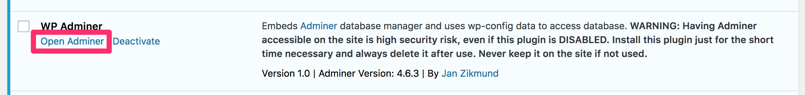

# WP Adminer

### Plugin to add Adminer database manager into WordPress administration

Embeds latest version of [Adminer](https://www.adminer.org) into WordPress. Adminer runs as standalone script in plugin's folder, and after initial login is used directly without any WordPress connection. This plugin only works as a wrapper to install adminer to the server and access it using WP database credentials from wp-config.php

## Usage

1. Install the plugin
2. Activate it
3. Click "Open Adminer" directly under plugin's name in list of plugins

## Warning

**Having Adminer accessible on the site is high security risk, even if this plugin is DISABLED. Install this plugin just for the short time necessary and always delete it after use. Never keep it on the site if not used. The author is not responsible for any harm that using this plugin or Adminer can cause, do it at your own risk.**